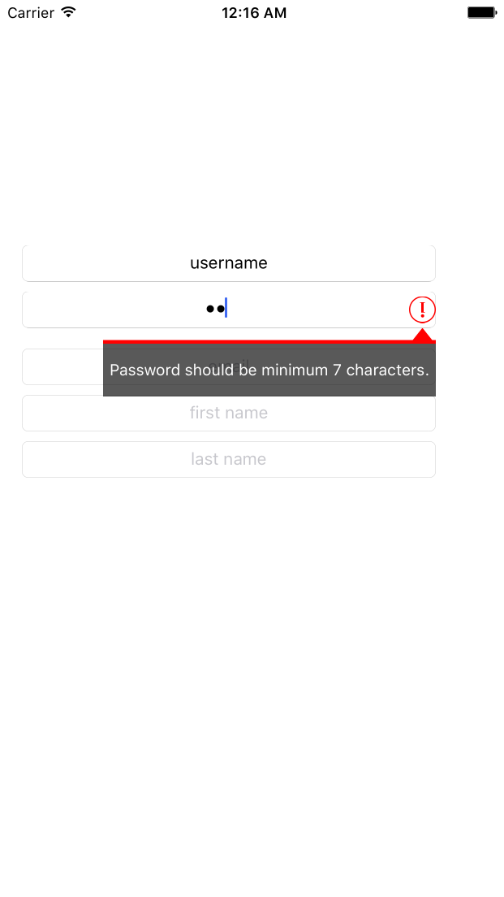

PSTextField-Swift
=================

A swift open source code for handling errors while validating UITextField.

### Introduction : -
This is a open source library, written in Objective C and Swift both. It gives you a compact layer to have all your textfield validation mechanism at a place and fully organised. We all write code for validation and verification of textfields in our application. I have collected my past work and put it here for you. Let's directly jump at code.

### Screenshot : -

### Source code: 
source code available at github, please get it from below urls: -

**Objective C** :  https://github.com/pawan4444/PSTextField-ObjC  
**Swift** : https://github.com/pawan4444/PSTextField-Swift

Integration Steps:  
Three simple step:  

  In storyboard/xib, add a UITextField and map the class to PSTextField.  
  Set the type of validation (PSDataValidationType) you want for this textfield.  
  Call validateInput method  
Checkout the demo project at from github.

### API:  
`func validateInput()`

### Validation Type:
  password = 1,   //alphanumeric password like hs939wd!  
  userName,       //alphanumeric username like john231  
  firstName,      //First name like Ramesh, Suresh, Gita etc  
  lastName,       //Last name Yadav, Naidu etc  
  email,          //Email id vishu@subdomain.domain  
  mobileNumber,   //Mobile number - +911234567890  
  date,  
  time,  
  place,  
  city,  
  state,  
  country,  
  empty         //Will check for empty string  
